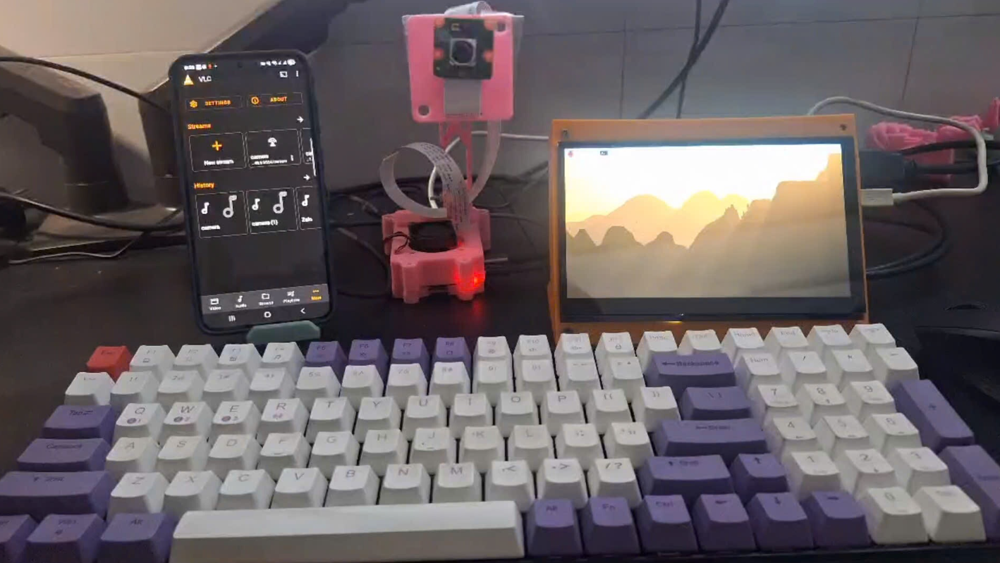
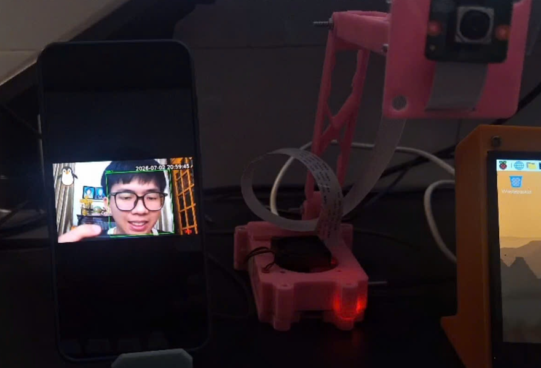
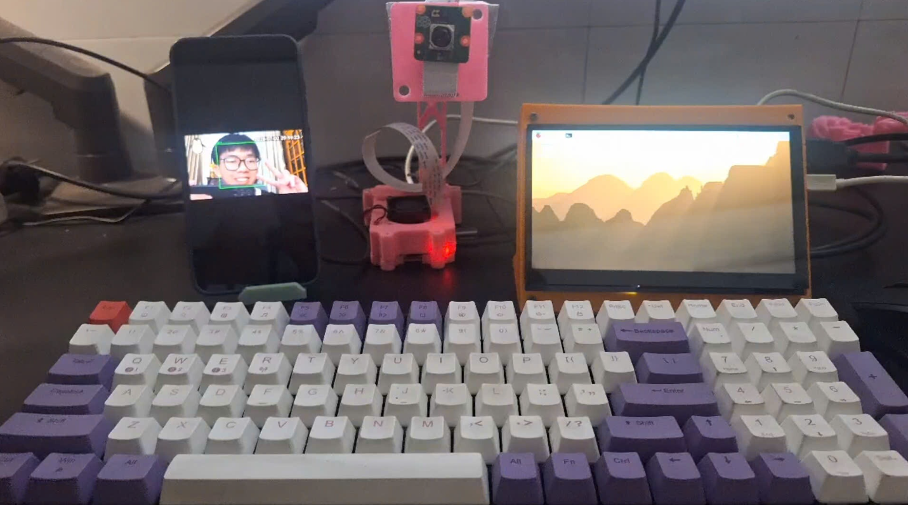

# Smart RTSP Camera with Face Detection on Raspberry Pi 4

A smart camera system built on Raspberry Pi 4 that streams live video over **RTSP** (viewable from VLC or a smartphone) while simultaneously running **OpenCV face detection**. Recording is event-driven: video is only saved to disk while a face is detected, with all detection events logged to a file. The pipeline is built with **GStreamer**, uses the Pi's **hardware H.264 encoder (v4l2h264enc)** to keep CPU usage low, and is fully implemented in multithreaded C++. The app **publishes** its stream to **MediaMTX**, a dedicated RTSP media server, which serves clients (VLC, smartphones, etc.) reliably over the network — including remotely via **Tailscale**.

## Key Features

- **RTSP Streaming via MediaMTX**: The app publishes H.264 video to a locally running MediaMTX server using `rtspclientsink`. MediaMTX handles all client connections, making playback in VLC and other RTSP clients stable and standards-compliant.
- **Face Detection**: OpenCV Haar cascade detection (frontal + profile cross-check) with bounding boxes drawn directly on the video feed.
- **Smart Recording**: Video is only written to disk while a face is present, controlled by a GStreamer `valve` element. Recording continues for a configurable tail period after the last detected face to avoid cutting clips short.
- **False-Positive Reduction**: Requires multiple consecutive confirmed detections before triggering recording, plus cross-validation between frontal and profile cascades.
- **Hardware-Accelerated Encoding**: Uses the Raspberry Pi's VideoCore `v4l2h264enc` encoder instead of software x264, reducing CPU load to a fraction of what software encoding requires. A single encoder instance feeds both the live stream and the recording branch via `tee`.
- **Event Logging**: Every recording start/stop and detection event is timestamped and written to `recordings/detect.log`.
- **Custom Overlays**: Configurable logo image and live clock overlay burned into both the stream and recordings.
- **Auto File Rotation**: Recordings are automatically split into fixed-length `.mp4` segments, named by timestamp for easy lookup.
- **Remote Access via Tailscale**: View the stream from outside the local network (mobile data, different Wi-Fi) by connecting through a Tailscale VPN, without port forwarding or exposing RTSP to the public internet.

## Output Products during Operation

Youtube video demo: [Youtube](https://youtube.com/shorts/g56brN7c-F0?si=FzKeVxVycKwF9Im4)








## System Requirements

### Hardware

- Raspberry Pi 4 Model B (4GB or 8GB RAM recommended)
- Raspberry Pi Camera Module (CSI, e.g. IMX708 / Camera Module 3)
- CSI ribbon cable connected securely on both ends
- Stable power supply (encoder + camera + detection together draw meaningful current)

### Software

- Raspberry Pi OS Bookworm (64-bit)
- GStreamer 1.0 (core, plugins-good, plugins-bad, libcamera plugin, app library)
- [MediaMTX](https://github.com/bluenviron/mediamtx) (standalone RTSP media server, runs alongside the app)
- OpenCV 4 (with Haar cascade data files)
- CMake + g++ (C++17 or later)
- VLC or any RTSP-compatible client for viewing the stream
- [Tailscale](https://tailscale.com) (optional, for remote viewing outside the local network)

## Workspace Structure

```
.
├── README.md
├── CMakeLists.txt
├── docs/
│   └── 01_Setup_Raspberry.md
├── src/
│   └── main.cpp
├── logo/
│   └── penguin-svgrepo.svg
├── recordings/
│   └── detect.log          (created automatically at runtime)
└── build/
```

MediaMTX is installed separately (outside this repo, e.g. `~/mediamtx/`) and runs as its own process.

## Pipeline Architecture

```text
Camera Module (IMX708)
        │
        ▼
   libcamerasrc
        │
        ▼
videoconvert + overlays (logo, clock)
        │
        ▼
     appsink ──────────────► [OpenCV worker thread]
                                    │  face detect (Haar cascade)
                                    │  draw bounding box
                                    ▼
                                appsrc
                                    │
                                    ▼
                              videoconvert
                                    │
                              v4l2h264enc
                          (single shared encoder)
                                    │
                              h264parse
                                    │
                                   tee
                                 ╱     ╲
                  Publish branch         Recording branch
                 rtspclientsink           valve (on/off)
                 (publish to MediaMTX)    h264parse
                        │                 splitmuxsink -> .mp4
                        ▼
                  MediaMTX server
                  (rtsp://<PI_IP>:8554/camera)
                        │
                        ▼
              VLC / phone (LAN or via Tailscale)
```

## Running the System

1. Start MediaMTX (in its own terminal, keep it running):
   ```bash
   cd ~/mediamtx
   ./mediamtx
   ```
2. Build and run the app (in another terminal):
   ```bash
   cd build
   make -j4
   ./app
   ```
3. Connect from VLC:
   ```
   rtsp://<PI_IP>:8554/camera
   ```
   Use the Pi's local IP on the same network, or its Tailscale IP (`100.x.x.x`) for remote access.

## Development & Documentation

- [Raspberry Pi Setup Guide](./docs/01_Setup_Raspberry.md)

## References

- GStreamer Documentation: [gstreamer.freedesktop.org](https://gstreamer.freedesktop.org/documentation/)
- MediaMTX Documentation: [github.com/bluenviron/mediamtx](https://github.com/bluenviron/mediamtx)
- libcamera Documentation: [libcamera.org](https://libcamera.org)
- OpenCV Documentation: [docs.opencv.org](https://docs.opencv.org)
- Raspberry Pi Camera Documentation: [raspberrypi.com/documentation/accessories/camera.html](https://www.raspberrypi.com/documentation/accessories/camera.html)
- Tailscale Documentation: [tailscale.com/kb](https://tailscale.com/kb)

## Contact

For issues or inquiries, open a GitHub issue or contact [khanh.nguyenduy.work2000@gmail.com].